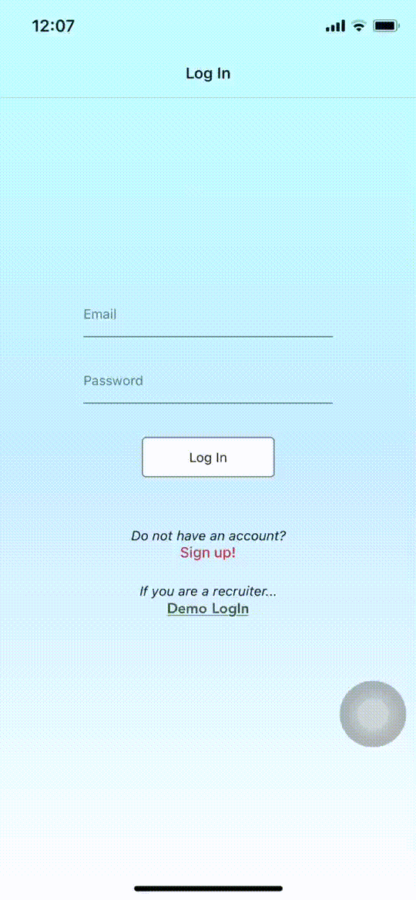
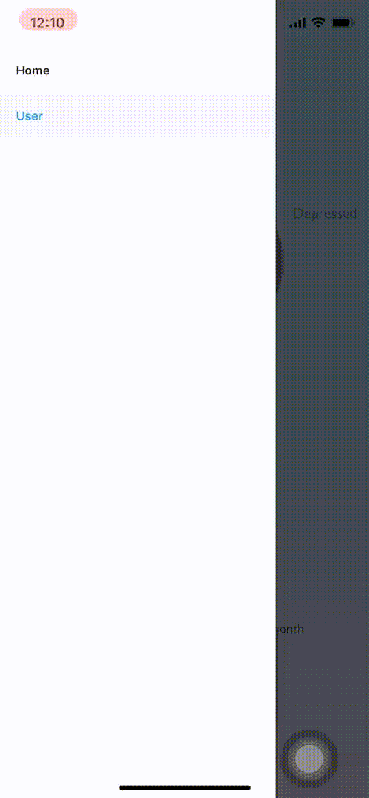

# Emotion Diary
## Overview

Emotion Diary is a mobile app that will help user store their feelings in the past. This mobile app can store and display recent emotions and up to one month data. With this app, users will understand how their moods had been through the last 24 hours, last week, or last month.

In the near future, a friend feature will be added to the app so that users can also know if their friends are feeling alright. From that, they can message the sad friend to cheer them up.

The big purpose of this app is to reduce the depression in people since there are quite many people committed suicide due to depression.  

### Current Features
- Firebase authentication
- Firebase real-time cloud data
- Data visualization with Victory Chart

### Future Features
- [ ] Adding Friend
- [ ] Text/Chat in between users
- [ ] Automatic add happy user with sad user based on nearby location

## Screenshots / Demo
### Sign-in Screen

### Home Screen

### Data visualization Screen

